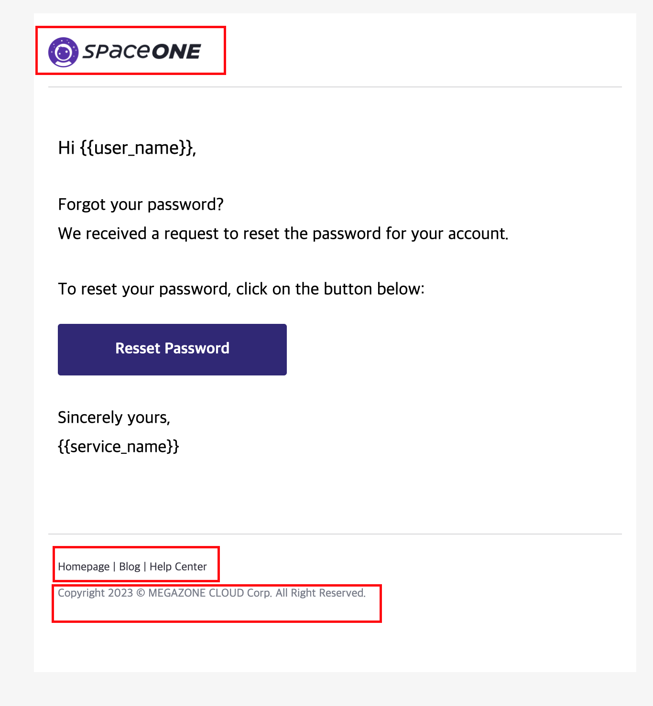

# Overview

Email Template files for identity (Version 1.12.x)
Cloudforet can send email to user when user has email address for

* reset password
* send verification code
* notify user creation

You can change email contents by your self, after changing template contents.

## Reset Password Template



| Variable     | Default Values                              | New Values                                  |
|--------------|---------------------------------------------|  ---- |
| Header image | https://img.stibee.com/70522_1678432526.png | https://raw.githubusercontent.com/cloudforet-io/artwork/main/logo/Cloudforet_logo--horizontal-color.png |
| homepage | https://spaceone.megazone.io                | https://HOMEPAGE.EXAMPLE.COM |
| blog | https://blog.spaceone.megazone.io/          | https://BLOG.EXAMPLE.COM/ |
| Help center | https://help.spaceone.megazone.com/         | https://HELP.EXAMPLE.COM/ |
| Footer | Copyright 2023 © MEGAZONE CLOUD Corp.       | Copyright © 2024 Cloudforet Project. |


# change.sh

* replace string to my own
* update your own KEYWORD

```
> change.sh  
```

The change.sh file contents are as follows:

```
#!/bin/bash

# Template directory
dir=$(pwd)/template

# Find all template files
files=$(find "$dir" -type f)

# Change blog
for file in $files; do
  sed -i'' -e "s/blog.spaceone.megazone.io/BLOG.EXAMPLE.COM/g" "$file"
done

# Change help center
for file in $files; do
  sed -i'' -e "s/help.spaceone.megazone.com/HELP.EXAMPLE.COM/g" "$file"
done

# Change home page
for file in $files; do
  sed -i'' -e "s/spaceone.megazone.io/HOMEPAGE.EXAMPLE.COM/g" "$file"
done

# Change Header Image
for file in $files; do
  sed -i'' -e "s/img.stibee.com\/70522_1678432526.png/raw.githubusercontent.com\/cloudforet-io\/artwork\/main\/logo\/Cloudforet_logo--horizontal-color.png/g" "$file"
done

# Change Footer
for file in $files; do
  sed -i'' -e "s/Copyright 2023 © MEGAZONE CLOUD Corp./Copyright © 2024 Cloudforet Project./g" "$file"
done

# Create ConfigMap YAML file
cat > email-template.yaml << EOF
apiVersion: v1
kind: ConfigMap
metadata:
  name: email-template-configmap
data:
EOF

# Loop all files
for file in $files; do
  # basename
  filename=$(basename "$file")
  echo "  $filename: |-" >> email-template.yaml
  cat $file | sed 's/^/    /' >> email-template.yaml
done
```

# Deployment

## Create ConfigMap

```
kubectl apply configmap -f email-template.yaml
```

The email-template directory in identity POD: 
```
/usr/local/lib/python3.8/site-packages/spaceone_identity-1.12.4-py3.8.egg/spaceone/identity/template
```

## Update Helm Value file

Add configmmap to volume
Mount volume to identity

```
identity:

...

  volumeMounts:
    application_grpc:
      - name: email-template
        mountPath: /usr/local/lib/python3.8/site-packages/spaceone_identity-1.12.4-py3.8.egg/spaceone/identity/template
        readOnly: true

  volumes:
    - name: email-template
      configMap:
        name: email-template-configmap
    - name: timezone
      hostPath:
        path: /usr/share/zoneinfo/Asia/Seoul
    - name: log-volume
      emptyDir: {}

```

## Update Helm chart

